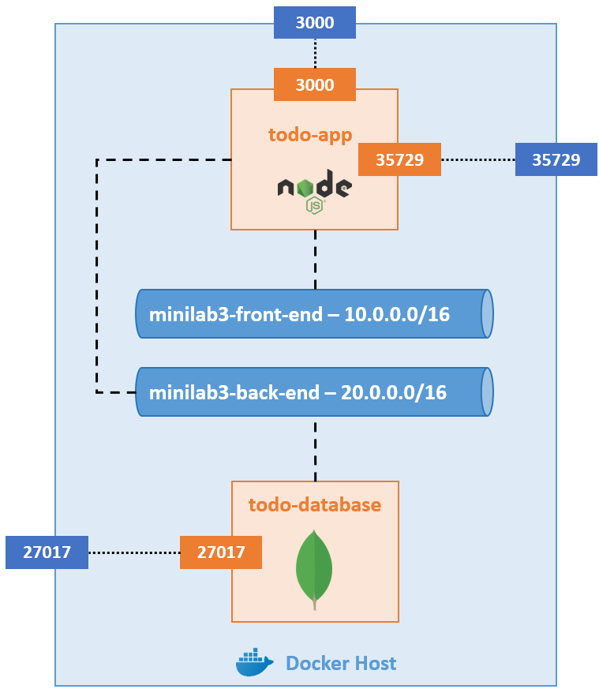

# Minilab 3 - To-do list

Dans ce minilab, vous allez créer une application de To-do list hébergée dans l'architecture suivante :

### Ressources

Crééez cette architecture à l'aide de la Docker CLI :

- Réseau front
    - **Nom** - minilab3-front-end
    - **Adresse de sous-réseau** - 10.0.0.0/16
    - **Driver** - bridge

- Réseau back
    - **Nom** - minilab3-back-end
    - **Adresse de sous-réseau** - 20.0.0.0/16
    - **Driver** - bridge

- Front
    - **Nom** - todo-app
    - **Image** - image custom construite à partir des sources localisées [ici](./src/)
    - **Réseau** - minilab3-front-end et minilab3-back-end
    - **Port-mapping** - Port 3000 du Docker Host avec le port 3000 du conteneur
    - **Port-mapping** - Port 35729 du Docker Host avec le port 35729 du conteneur

- Base de données
    - **Nom** - todo-database
    - **Image** - mongo
    - **Version de l'image** - 6
    - **Réseau** - minilab3-back-end
    - **Données** - les données du répertoire /data/db du conteneur doivent être persistées sur le Docker Host
    - **Port-mapping** - Port 27017 du Docker Host avec le port 27017 du conteneur

### Tests

- Accédez à l'application via l'URL http://localhost:3000